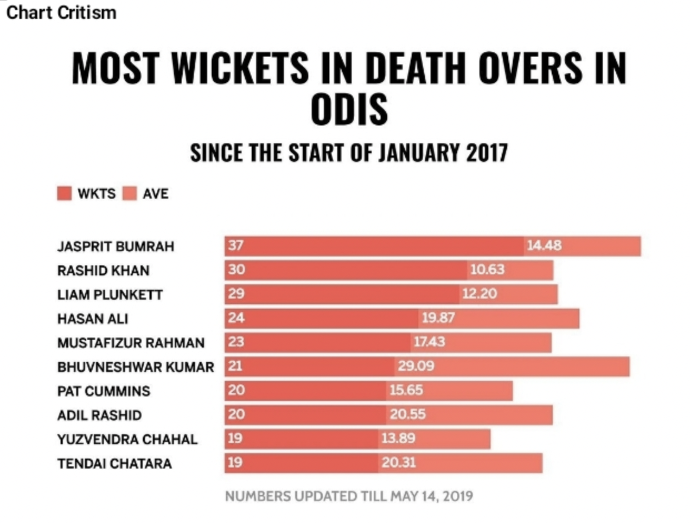
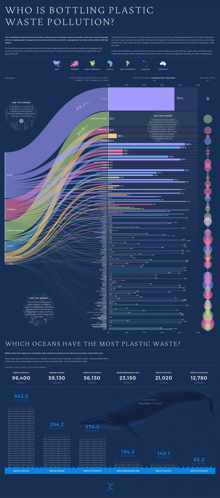

```{r setup, include=FALSE}
## **DO NOT EDIT THIS CODE CHUNK**
knitr::opts_chunk$set(echo = TRUE)

#run install.packages("cherryblossom") on the console to get the run17 dataset

library(tidyverse)
library(cherryblossom)  
```


## Exercise 1
This is my answer:
1. There are 19961 runners in the data set
2. There are nine variables for each runner 
3. Event is Categorical variables
net_sec is Discrete variables


## Exercise 2

_The R chunk below generates the given histogram. Edit the code to account for the amendments stated in exercise 2. (Please delete this message before submission!)_

_Edit the code below:_
```{r run17_data_viz, warning = FALSE, out.width = "80%"}
ggplot(data = run17, 
       mapping = aes(x = sex, y = net_sec)) +
  geom_boxplot()+
  labs(
    x = "sex",
    y = "net_sec",
    title = "the relationship between sex identified runner, time taken to finish and chosen event"
   ) + 
  facet_wrap(~ event)
```


## Exercise 3

In 10 mile, Male's median, upper and lower quatile running time is 5500s,6100s and 4800s repectively. 
Female's median, upper and lower quatile running time is 6100s, 6400s and 5500s repectively 
Male's fastest time is about 2900s, female's fastest time is about 3400s.
In 5k events, Male's median, upper and lower quatile running time is 2100s, 2600s and 1800s repectively.
Female's median, upper and lower quatile running time is 2200s, 2900s and 2000s respectely. 
Male's fastest time is about 2100s, female's fastest time is about 2200s.
In the graph, the box plot of man the below female 
Therefore, the time taken for male ti finish the runinng is much faster than female. 
The longer the distance, the longer the time takes for runners to finish. 


## Exercise 4

```{r bad_viz, echo = FALSE, out.width = "80%"}
# edit the file path accordingly

```


Justin Nzeh, "Most Wickets in Death Overs in Odis" [Online]. Available at: https://zebranewsonline.com/most-wickets-in-death-overs-in-odis/ (Accessed: March 15, 2022)


The above image presents a bad data visualisation because:

-Reason 1: Although the average is of a lighter shade, you can easily miss the color differences. When making such a chart, a good color to use in contrasting orange is blue.
-Reason 2: the bar chart is stacked with numbers that have different units. Wickets are measured in length using mainly inches and centimeters. On the other hand, averages have no units.


## Exercise 5

```{r good_viz, echo = FALSE, out.width = "80%"}
# edit the file path accordingly

```


Jamie Kettle, "Plastic Waste Pollution data visualisation" [Online]. Available at: https://www.behance.net/gallery/106936329/Plastic-Waste-Pollution-data-visualisation (Accessed: October 29th 2020)


The above image presents a good data visualisation because:

-Reason 1: The infographic provides a clear and precise picture on current surface plastic mass by ocean, measuring it in a creative way. We can see plastic waste management for every country in a colored bar chart. The names of the countries that report 100% of all their plastic waste handled properly are highlighted in bold. 
-Reason 2: the GDP of the country and efficient plastic waste management aren’t always correlated – you can see it by irregular patterns shown in the infographic.


